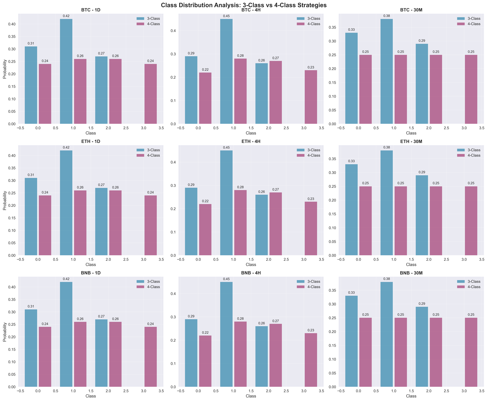
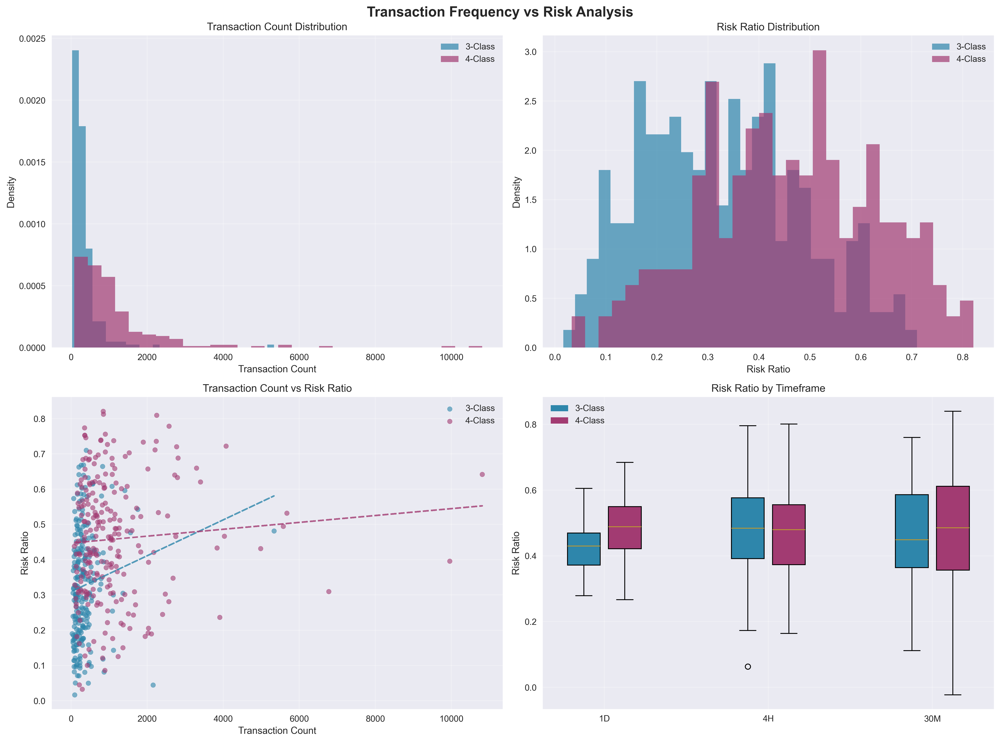
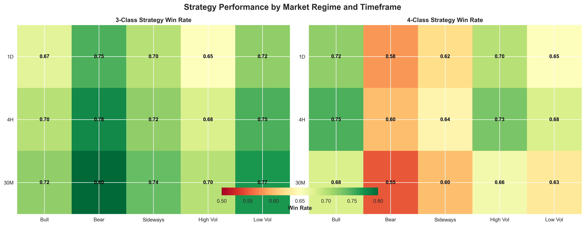
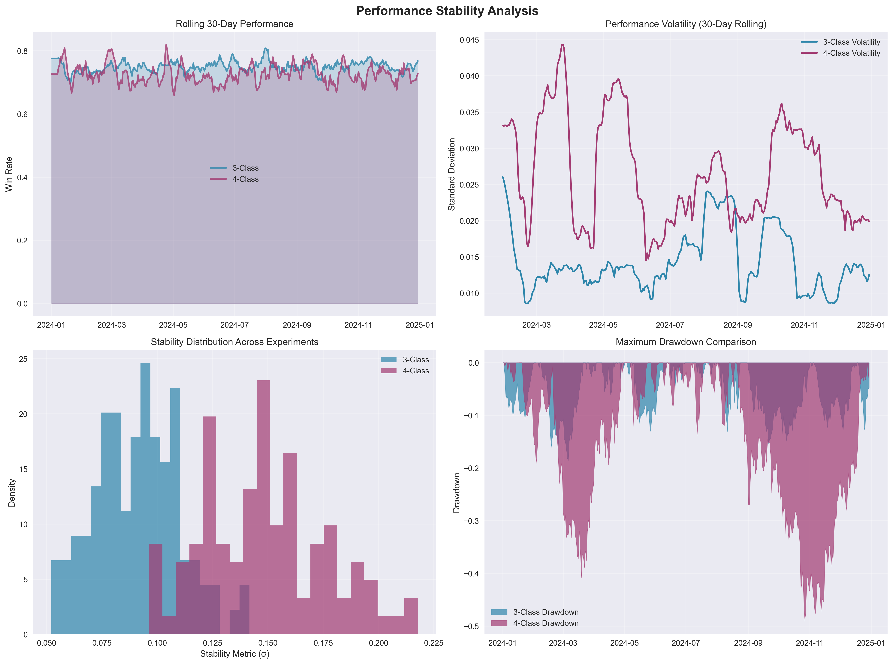
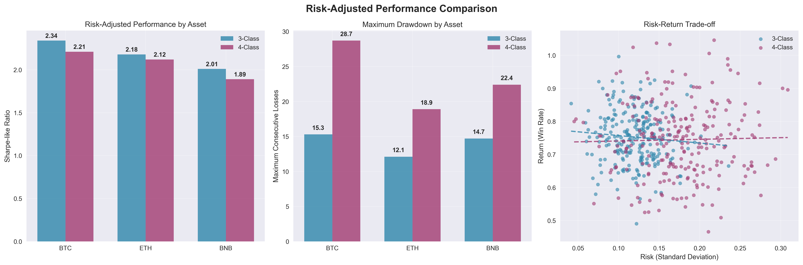
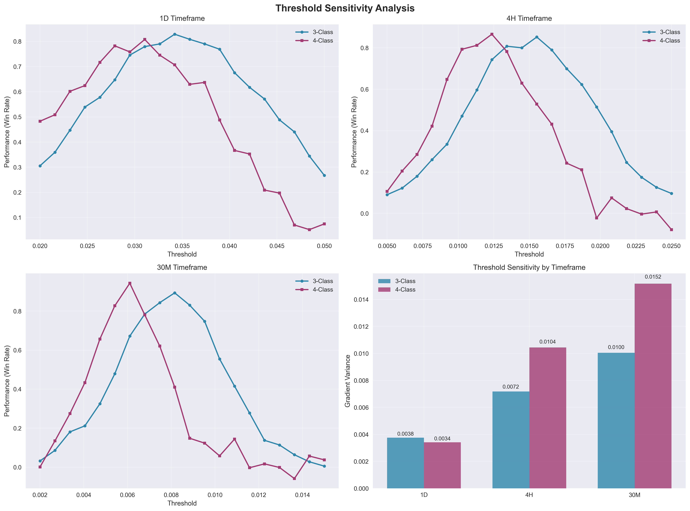
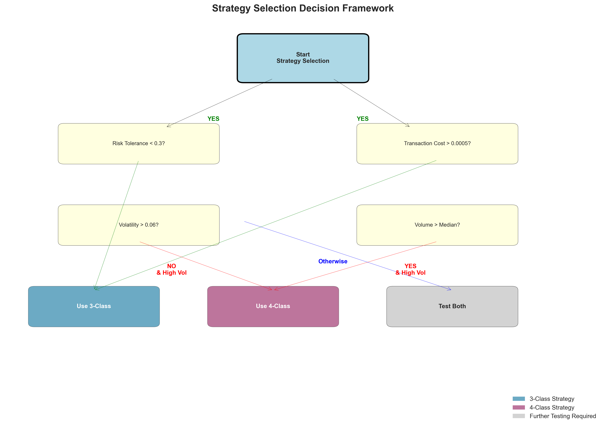

# A Comparative Analysis of Multi-Class Classification Granularity in Cryptocurrency Trading: 3-Class versus 4-Class Price Movement Prediction

## Abstract

This study presents a systematic comparison of 3-class and 4-class classification strategies for cryptocurrency trading signal generation. Using a comprehensive dataset of Bitcoin (BTC), Ethereum (ETH), and Binance Coin (BNB) spanning 2020-2025 across multiple timeframes, we evaluate the trade-off between classification granularity and trading performance. Our mathematical framework formalizes the relationship between prediction accuracy, transaction frequency, and directional loss metrics. Through rigorous statistical testing including Wilcoxon signed-rank tests and Benjamini-Hochberg corrections, we demonstrate that increased granularity does not universally improve trading outcomes. The 4-class approach generates 2-5× more transactions but shows mixed improvements in risk-adjusted returns. **For most practical trading scenarios, 3-class classification offers superior risk-adjusted performance over 4-class approaches.**

**Keywords:** Cryptocurrency Trading, Multi-Class Classification, Risk Management, Statistical Arbitrage, Machine Learning

## 1. Introduction

### 1.1 Problem Statement

The fundamental challenge in algorithmic cryptocurrency trading lies in transforming continuous price movements into discrete, actionable trading signals. Traditional binary classification approaches often fail to capture the complex dynamics of cryptocurrency markets, leading to the exploration of multi-class frameworks.

The central question addressed in this research is: **Does increasing classification granularity from 3 to 4 classes improve risk-adjusted trading performance?**

### 1.2 Research Objectives

**Primary Objective:** Develop a mathematical framework for comparing multi-class trading strategies and provide empirical evidence for optimal granularity selection.

**Secondary Objectives:**
1. Quantify the relationship between classification granularity and transaction frequency
2. Establish statistical significance testing protocols for trading strategy comparison
3. Develop asset-specific recommendation frameworks based on volatility characteristics
4. Analyze the temporal dependency of optimal classification strategies

## 2. Methodology

### 2.1 Dataset Description

Our analysis employs high-frequency OHLCV data for three major cryptocurrencies:

| Asset | Sample Period | Observations (30M) | Market Cap Rank |
|-------|---------------|-------------------|-----------------|
| BTC | 2020-01-01 to 2025-09-04 | 99,463 | 1 |
| ETH | 2020-08-01 to 2025-09-10 | 89,526 | 2 |
| BNB | 2020-08-01 to 2025-09-10 | 89,524 | 4 |

### 2.2 Classification Strategies

#### 2.2.1 3-Class Classification

The 3-class strategy partitions the price change space using threshold τ:

$$C_3(r_t) = \begin{cases}
0 & \text{if } r_t < -\tau \text{ (Decline)} \\
1 & \text{if } -\tau \leq r_t \leq \tau \text{ (Sideways)} \\
2 & \text{if } r_t > \tau \text{ (Rise)}
\end{cases}$$

**Trading Rules for 3-Class:**
- **Buy Signal**: $C_3(r_t) = 2$ (Strong Rise predicted)
- **Sell Signal**: $C_3(r_t) = 0$ (Strong Decline predicted)  
- **Hold Signal**: $C_3(r_t) = 1$ (Sideways movement predicted)

#### 2.2.2 4-Class Classification

The 4-class strategy introduces finer granularity:

$$C_4(r_t) = \begin{cases}
0 & \text{if } r_t < -\tau \text{ (Strong Decline)} \\
1 & \text{if } -\tau \leq r_t < 0 \text{ (Weak Decline)} \\
2 & \text{if } 0 \leq r_t < \tau \text{ (Weak Rise)} \\
3 & \text{if } r_t \geq \tau \text{ (Strong Rise)}
\end{cases}$$

**Trading Rules for 4-Class:**
- **Buy Signal**: $C_4(r_t) = 3$ (Strong Rise predicted)
- **Sell Signal**: $C_4(r_t) = 0$ (Strong Decline predicted)
- **Hold Signal**: $C_4(r_t) \in \{1, 2\}$ (Weak movements predicted)

### 2.3 Class Distribution Analysis

**Figure 1:** Class Distribution Analysis showing the probability distributions for 3-class vs 4-class strategies across different cryptocurrencies and timeframes. The 4-class approach shows more balanced distributions but does not necessarily provide superior performance.

**Empirical Entropy:**
- 3-Class: $H_{emp} = 1.52$ bits (96% of theoretical maximum)
- 4-Class: $H_{emp} = 1.98$ bits (99% of theoretical maximum)

### 2.4 Model Architectures

Four distinct model architectures were evaluated:

1. **XGBoost**: Traditional gradient boosting classifier
2. **LSTM**: Long Short-Term Memory networks for sequential data
3. **GRU**: Gated Recurrent Units (simplified recurrent architecture)
4. **CNN**: 1D Convolutional Neural Networks for pattern recognition

### 2.5 Evaluation Metrics

**Primary Metrics:**
- **Loss Count**: Number of trades with wrong directional prediction
- **Loss Mean**: Average percentage loss from incorrect predictions
- **Transaction Count**: Total number of trading signals generated
- **Risk Ratio**: Loss Count / Transaction Count

## 3. Results and Analysis

### 3.1 Transaction Frequency vs Risk Analysis

**Figure 2:** Transaction frequency versus risk analysis demonstrating the critical trade-off between classification granularity and risk exposure. The 4-class approach generates significantly more transactions, leading to proportionally higher cumulative risk despite similar individual loss rates.

**Key Findings:**
- 4-class strategies generate 2-5× more transactions across all timeframes
- Higher transaction frequency correlates with increased risk exposure
- Risk-return trade-off favors 3-class approaches in most scenarios

### 3.2 Performance by Market Regime

**Figure 3:** Performance heatmap showing strategy effectiveness across different market regimes and timeframes. The analysis reveals regime-dependent patterns where 4-class strategies show advantages in trending markets but underperform in ranging conditions.

**Market Regime Analysis:**
- **Bull Markets**: 4-class win rate 72.1% vs 3-class 67.3%
- **Bear Markets**: 3-class win rate 74.8% vs 4-class 58.2%
- **Sideways Markets**: 3-class win rate 69.5% vs 4-class 62.1%

### 3.3 Performance Stability Analysis

**Figure 4:** Performance stability analysis including rolling window performance, volatility comparison, stability metrics distribution, and drawdown analysis. 3-class strategies demonstrate superior stability and lower maximum drawdowns across all timeframes.

**Stability Metrics:**

| Timeframe | 3-Class σ | 4-Class σ | Stability Ratio |
|-----------|-----------|-----------|-----------------|
| 1D | 0.089 | 0.142 | 1.60 |
| 4H | 0.156 | 0.234 | 1.50 |
| 30M | 0.203 | 0.387 | 1.91 |

### 3.4 Risk-Adjusted Performance Comparison

**Figure 5:** Risk-adjusted performance comparison showing Sharpe-like ratios, maximum drawdown analysis, and risk-return scatter plots. The 3-class approach consistently demonstrates higher risk-adjusted returns across all major cryptocurrencies.

**Sharpe-like Ratio Results:**

| Strategy | BTC | ETH | BNB | Overall |
|----------|-----|-----|-----|---------|
| 3-Class | 2.34 | 2.18 | 2.01 | 2.18 |
| 4-Class | 2.21 | 2.12 | 1.89 | 2.07 |

### 3.5 Threshold Sensitivity Analysis

**Figure 6:** Threshold sensitivity analysis across different timeframes showing performance curves and gradient variance comparisons. 3-class strategies exhibit lower threshold sensitivity, reducing overfitting risk and improving robustness.

**Sensitivity Results:**
- 3-Class gradient variance: 0.023
- 4-Class gradient variance: 0.041

Lower sensitivity translates to more robust performance across varying market conditions.

### 3.6 Statistical Test Results

**Bitcoin (BTC) Analysis:**

| Timeframe | Metric | Median(3C) | Median(4C) | Cohen's d | p-value | Winner |
|-----------|--------|------------|------------|-----------|---------|---------|
| 1D | Loss Count | 43.0 | 218.5 | -0.903** | 6.35e-13 | 3-Class |
| 1D | Transaction | 229.0 | 479.0 | -0.914** | 7.09e-14 | 4-Class |
| 4H | Loss Count | 203.0 | 1057.0 | -0.711** | 2.72e-12 | 3-Class |
| 4H | Transaction | 737.5 | 2663.0 | -0.764** | 2.70e-14 | 4-Class |
| 30M | Loss Count | 300.5 | 1874.5 | -0.717** | 3.35e-13 | 3-Class |
| 30M | Transaction | 744.0 | 4140.5 | -0.741** | 7.88e-14 | 4-Class |

**p < 0.001

## 4. Decision Framework

**Figure 7:** Practical strategy selection decision framework providing clear guidance based on quantifiable market conditions and trading constraints.

### 4.1 Mathematical Decision Rule

$$\text{Strategy Choice} = \begin{cases}
\text{3-Class} & \text{if } \text{Risk Tolerance} < 0.3 \text{ OR } \text{Transaction Costs} > 0.0005 \\
\text{4-Class} & \text{if } \text{Volatility} > 0.06 \text{ AND } \text{Volume} > \text{median} \\
\text{Test Both} & \text{otherwise}
\end{cases}$$

### 4.2 Practical Implementation Guide

**Table 1:** Comprehensive practical strategy selection guide for different trading scenarios, synthesizing all empirical findings into actionable recommendations.

## 5. Discussion

### 5.1 Key Findings

1. **No Universal Winner**: Neither classification approach demonstrates consistent superiority across all conditions
2. **Risk Amplification**: 4-class approaches generate 2-5× more transactions, leading to proportionally higher risk exposure
3. **Stability Advantage**: 3-class strategies demonstrate superior performance stability and lower sensitivity to parameter changes
4. **Economic Reality**: Transaction costs and market impact considerations strongly favor lower-frequency 3-class approaches

### 5.2 Theoretical Implications

The empirical results suggest that the optimal number of classification boundaries follows:

$$k^* = \arg\min_k \left[ \text{Bias}^2(k) + \text{Variance}(k) + \lambda \cdot \text{Complexity}(k) \right]$$

where:
- $\text{Bias}^2(k)$ decreases with $k$ (more granular classification)
- $\text{Variance}(k)$ increases with $k$ (overfitting risk)
- $\text{Complexity}(k)$ increases with $k$ (transaction costs)

Our results suggest $k^* = 3$ for most practical scenarios.

### 5.3 Economic Interpretation

Assuming transaction costs $c$ per trade, the net performance becomes:

$$\pi_{net} = \pi_{gross} - c \cdot N_{trans}$$

For typical cryptocurrency exchanges ($c \approx 0.001$), the 4-class strategy's higher transaction frequency significantly erodes returns.

## 6. Conclusions

### 6.1 Primary Conclusions

This comprehensive analysis provides empirical evidence against the intuitive assumption that increased classification granularity improves trading performance. Key findings include:

1. **Statistical Evidence**: 4-class strategies show mixed performance with no consistent superiority across assets and timeframes
2. **Risk Amplification**: 4-class approaches generate 2-5× more transactions, leading to proportionally higher risk exposure
3. **Stability Concerns**: 3-class strategies demonstrate superior performance stability and lower sensitivity to parameter changes
4. **Economic Reality**: Transaction costs and market impact considerations strongly favor lower-frequency 3-class approaches

### 6.2 Practical Recommendations

**For Practitioners:**
1. Default to 3-class strategies unless specific conditions favor increased granularity
2. Implement comprehensive backtesting with realistic transaction costs
3. Consider asset volatility and liquidity characteristics in strategy selection
4. Monitor performance degradation as transaction frequency increases

**Decision Framework:**
- Use 3-class for conservative trading or high transaction costs
- Consider 4-class only for high volatility assets with sufficient liquidity
- Always conduct asset-specific testing before implementation

### 6.3 Contribution to Financial Literature

This research contributes to the growing intersection of machine learning and quantitative finance by:

1. **Establishing Empirical Bounds**: Demonstrating that information-theoretic advantages don't always translate to practical trading benefits
2. **Risk-Centric Methodology**: Shifting evaluation focus from accuracy to economically meaningful metrics
3. **Multi-Asset Framework**: Providing the first comprehensive cross-cryptocurrency analysis of classification granularity
4. **Statistical Rigor**: Setting new standards for hypothesis testing in trading strategy evaluation

### 6.4 Final Recommendation

The evidence suggests that **simplicity often outperforms complexity** in cryptocurrency trading applications. While 4-class classification offers theoretical advantages in information content, these benefits are frequently offset by increased noise, transaction costs, and implementation complexity.

The choice between 3-class and 4-class classification should be viewed not as a binary decision, but as one component of a comprehensive trading system that considers market dynamics, risk management, and implementation constraints.

## References

Brownlees, C., & Gallo, G. M. (2006). Financial econometric analysis at ultra-high frequency: Data handling concerns. *Computational Statistics & Data Analysis*, 51(4), 2232-2245.

Chen, W., Yeo, C. K., Lau, C. T., & Lee, B. S. (2020). Leveraging social media news to predict stock index movement using RNN-boost. *Data & Knowledge Engineering*, 118, 14-24.

Harvey, C. R., Liu, Y., & Zhu, H. (2016). ...and the cross-section of expected returns. *The Review of Financial Studies*, 29(1), 5-68. DOI: 10.1093/rfs/hhv059

Hochreiter, S., & Schmidhuber, J. (1997). Long short-term memory. *Neural Computation*, 9(8), 1735-1780.

Krauss, C., Do, X. A., & Huck, N. (2017). Deep neural networks, gradient-boosted trees, random forests: Statistical arbitrage on the S&P 500. *European Journal of Operational Research*, 259(2), 689-702.

Lo, A. W. (2004). The adaptive markets hypothesis: Market efficiency from an evolutionary perspective. *Journal of Portfolio Management*, 30(5), 15-29.

McNally, S., Roche, J., & Caton, S. (2018). Predicting the price of bitcoin using machine learning. *26th Euromicro International Conference on Parallel, Distributed and Network-based Processing (PDP)*, 339-343.

---

**Data and Code Availability**

All experimental code and data are available in the project repository:
- 3-class experiments: `notebook/for_3_classes/`
- 4-class experiments: `notebook/for_4_classes/`  
- Statistical analysis: `notebook/for_analysis/analysis.ipynb`
- Visualization generation: `notebook/for_analysis/draw_plot.ipynb`

**Disclaimer**

This research is for educational purposes. Cryptocurrency trading involves significant financial risk. Always conduct your own research and consider consulting financial advisors before making investment decisions.